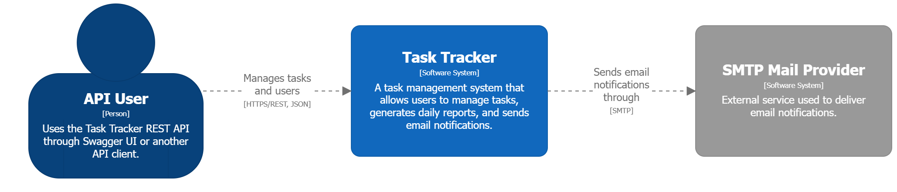
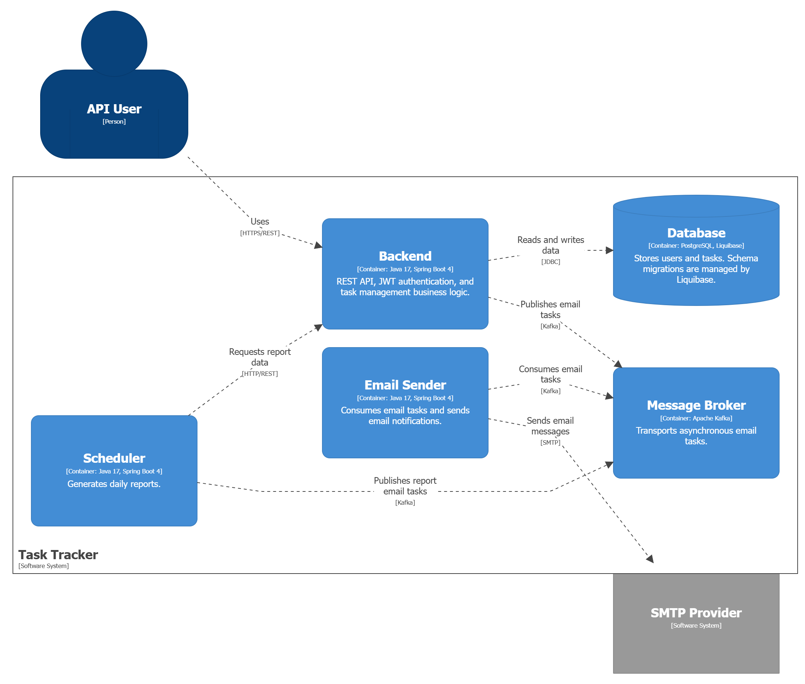
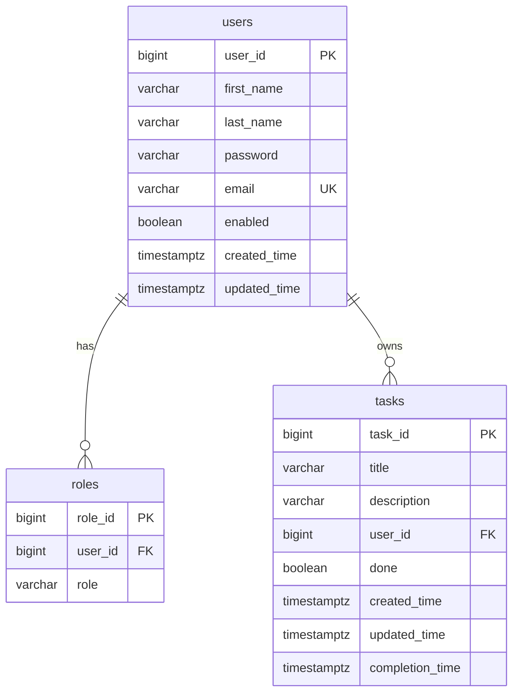
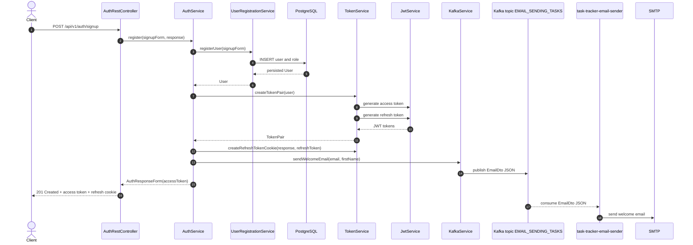
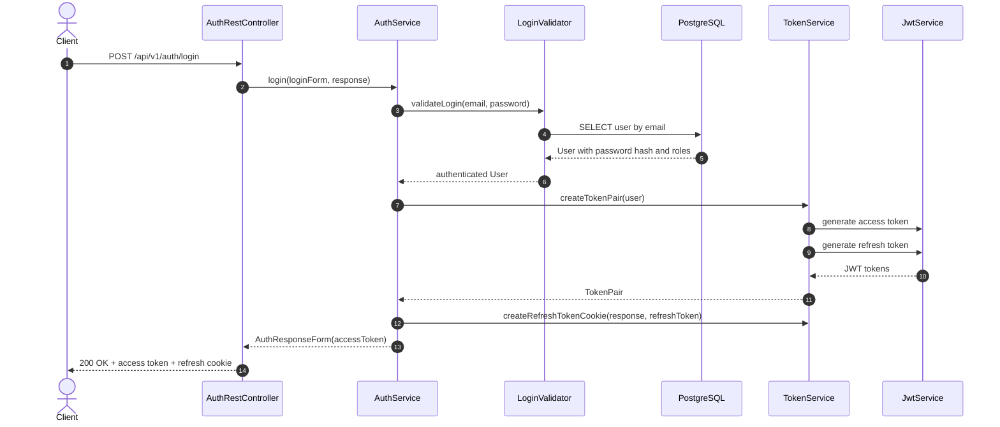

# Multiuser Task Scheduler 🚀

Микросервисное backend-приложение для управления задачами в многопользовательской среде.

Проект демонстрирует не только CRUD API, но и полноценную распределенную архитектуру: JWT-аутентификацию, централизованную конфигурацию, service discovery, PostgreSQL с миграциями Liquibase, асинхронную обработку email-команд через Kafka и отдельный scheduler-сервис для ежедневных отчетов по задачам.

## 📚 Содержание

- [Основные функции](#-основные-функции)
- [Архитектура](#-архитектура)
- [Схема базы данных](#-схема-базы-данных)
- [Диаграммы потока запросов login и signup](#диаграммы-потока-запросов-login-и-signup)
- [Технологический стек](#-технологический-стек)
- [Краткое описание микросервисов](#-краткое-описание-микросервисов)
- [Быстрый запуск](#-быстрый-запуск)
- [API](#-api)
- [Тестирование](#-тестирование)
- [Проект демонстрирует](#-проект-демонстрирует)
- [Контакты](#-контакты)

## 🌟 Основные функции

### 👤 Работа с пользователями

- ✅ Регистрация и авторизация пользователей.
- 🔐 JWT-based authentication: access token + refresh token в cookie.
- 🧩 Ролевая модель доступа: `USER` и `ADMIN`.
- 🙋 Получение данных текущего пользователя.
- 👥 Получение списка пользователей вместе с их задачами.

### ✅ Работа с задачами

- ➕ Создание задач.
- ✏️ Редактирование задач.
- ✔️ Пометка задачи как выполненной.
- 🗑️ Удаление задач.
- 📋 Получение одной задачи или списка задач текущего пользователя.

### 📧 Умные оповещения по почте

- ✉️ Приветственное письмо после регистрации.
- 🔔 Ежедневные email-отчеты по задачам через отдельный scheduler-сервис.
- 📌 В отчет попадают:
  - задачи, выполненные за день;
  - задачи, которые еще предстоит выполнить.
- ⚡ Асинхронная доставка email-команд через Kafka topic `EMAIL_SENDING_TASKS`.

### 🧱 Инфраструктура и надежность

- 🗄️ PostgreSQL с версионированными миграциями Liquibase.
- 🧭 Service discovery через Eureka Server.
- ⚙️ Централизованная конфигурация через Spring Cloud Config.
- 🐳 Готовый Docker Compose для локального запуска всех сервисов.
- 📖 Swagger/OpenAPI-документация для backend API.

## 🏗️ Архитектура

### System Context Diagram


### Container Diagram (без eureka-server и config-server)


## 🗃️ Схема базы данных

Backend-сервис использует PostgreSQL. Структура таблиц управляется Liquibase-миграциями.



## Диаграммы потока запросов login и signup

### signup



### login


## 🛠️ Технологический стек

| Категория | Технологии |
| --- | --- |
| Language / Runtime | Java 17 |
| Backend | Spring Boot 4, Spring Web, Spring Validation |
| Security | Spring Security, JWT |
| Data | Spring Data JPA, PostgreSQL, Liquibase |
| Microservices | Spring Cloud Config, Netflix Eureka |
| Messaging | Apache Kafka, Spring Kafka |
| Email | Spring Mail, SMTP |
| API docs | Springdoc OpenAPI, Swagger UI |
| Build / Runtime | Maven, Docker, Docker Compose |
| Testing | JUnit, Spring Boot Test, Spring Security Test, Testcontainers, Spring Kafka Test |

## 📦 Краткое описание микросервисов

| Тип       | Сервис                      | Назначение |
|-----------|-----------------------------| --- |
| служебный | `config-server`             | Централизованная конфигурация микросервисов через Spring Cloud Config. |
| служебный | `eureka-server`             | Service discovery для регистрации и обнаружения сервисов. |
| бизнес    | `task-tracker-backend`      | Основной REST API: auth, users, tasks, JWT, PostgreSQL, Liquibase, Kafka publishing. |
| бизнес    | `task-tracker-scheduler`    | Планировщик ежедневных отчетов по задачам; получает данные из backend и публикует email-команды в Kafka. |
| бизнес    | `task-tracker-email-sender` | Kafka consumer, который получает email-команды и отправляет письма через SMTP. |

## ⚡ Быстрый запуск

### 📋 Требования

- Docker и Docker Compose.
- Свободные порты: `5432`, `8888`, `8761`, `8080`, `8081`, `8082`, `9092`.

### 1. Клонируйте репозиторий

```powershell
git clone https://github.com/BaTORfly/multi-user-task-sheduler.git
cd multi-user-task-sheduler
```

### 2. Переменные окружения

В проекте есть два шаблона переменных окружения:

- `.env.dev.example` — пример для запуска в режиме `dev`.
- `.env.prod.example` — пример для запуска в режиме `prod`.

Шаблоны уже заполнены демонстрационными значениями, чтобы проект можно было быстро запустить и проверить.

Для начала необходимо создать `.env` в корне проекта

Для dev-режима скопируйте шаблон в `.env`:

```powershell
copy .env.dev.example .env
```

Для prod-режима скопируйте шаблон в `.env`:

```powershell
copy .env.prod.example .env
```

Основные переменные окружения на примере `.env.prod.example`:

| Переменная | Описание                                                                                                        |
| --- |-----------------------------------------------------------------------------------------------------------------|
| `PROD_SPRING_PROFILES_ACTIVE` | Spring-профиль для prod-запуска. По умолчанию `prod`.                                                           |
| `CONFIG_REPOSITORY_URI` | Git-репозиторий, из которого Config Server загружает конфиги.                                                   |
| `PROD_CONFIG_REPOSITORY_LABEL` | Ветка, тег или commit hash репозитория конфигураций для prod-режима.                                            |
| `POSTGRES_DB` | Имя базы данных PostgreSQL.                                                                                     |
| `POSTGRES_USER` | Пользователь PostgreSQL.                                                                                        |
| `POSTGRES_PASSWORD` | Пароль пользователя PostgreSQL.                                                                                 |
| `JWT_SECRET` | Секрет для подписи JWT access и refresh token.                                                                  |
| `JWT_ACCESS_LIFETIME` | Время жизни access token в секундах.                                                                            |
| `JWT_REFRESH_LIFETIME` | Время жизни refresh token в секундах.                                                                           |
| `SCHEDULER_EMAIL` | Email технического scheduler-пользователя.                                                                      |
| `SCHEDULER_PASSWORD` | Пароль scheduler-пользователя для авторизации scheduler-сервиса в backend.                                      |
| `SCHEDULER_HASHED_PASSWORD` | BCrypt-хеш пароля (10 раундов) scheduler-пользователя для начальной записи через Liquibase.                     |
| `SCHEDULER_DAILY_CRON` | Cron-выражение ежедневного запуска отчётов scheduler-сервисом.                                                  |
| `SCHEDULER_TIME_ZONE` | Часовой пояс scheduler-сервиса.                                                                                 |
| `SPRING_MAIL_HOST` | SMTP host для отправки email.                                                                                   |
| `SPRING_MAIL_PORT` | SMTP port                                                                                                       |
| `SPRING_MAIL_USERNAME` | SMTP username - tasktrackerpetproject@gmail.com - служебная почта системы, создана специально для этого проекта |
| `SPRING_MAIL_PASSWORD` | application password tasktrackerpetproject@gmail.com                                                            |

### 3. Запуск приложения

Dev-режим:

```powershell
docker compose -f docker-compose-dev.yml up --build
```

Prod-режим:

```powershell
docker compose -f docker-compose-prod.yml up --build -d
```

После запуска Docker Compose поднимет PostgreSQL, Kafka, Config Server, Eureka Server и все сервисы task tracker.

### 4. Остановка приложения

Остановить dev-режим:

```powershell
docker compose -f docker-compose-dev.yml down
```

Остановить prod-режим:

```powershell
docker compose -f docker-compose-prod.yml down
```

### 5. Описание порядка запуска сервисов

1. `postgresdb`, `kafka`, `config-server` стартуют первыми, между ними зависимостей нет.

2. `eureka-server` стартует после `config-server`, причем ждет `config-server: service_healthy`.

3. `task-tracker-email-sender` стартует после:
`kafka: service_started`, `config-server: service_healthy`, `eureka-server: service_healthy`.

4. `task-tracker-backend` стартует после:
`postgresdb: service_healthy`, `kafka: service_started`, `config-server: service_healthy`, `eureka-server: service_healthy`.

5. `task-tracker-scheduler` стартует после:
`kafka: service_started`, `config-server: service_healthy`, `eureka-server: service_healthy`, `task-tracker-backend: service_started.`

### 🔗 Основные адреса

| Сервис | URL |
| --- | --- |
| Backend API | `http://localhost:8080` |
| Swagger UI | `http://localhost:8080/swagger-ui.html` |
| Email Sender | `http://localhost:8081` |
| Scheduler | `http://localhost:8082` |
| Eureka Dashboard | `http://localhost:8761` |
| Config Server | `http://localhost:8888` |
| PostgreSQL | `localhost:5432` |
| Kafka | `localhost:9092` |

## 📡 API

📖 Подробная интерактивная документация доступна в Swagger UI:

```text
http://localhost:8080/swagger-ui.html
```

Основные группы endpoint'ов:

| Группа | Endpoint | Возможности |
| --- | --- | --- |
| Auth | `/api/v1/auth/signup` | Регистрация пользователя. |
| Auth | `/api/v1/auth/login` | Вход пользователя, выдача access token и refresh cookie. |
| Auth | `/api/v1/auth/logout` | Выход пользователя и очистка refresh cookie. |
| Auth | `/api/v1/auth/refresh-token` | Обновление access token по refresh token. |
| Tasks | `/api/v1/tasks` | Создание задачи, получение списка задач текущего пользователя. |
| Tasks | `/api/v1/tasks/{taskId}` | Получение, обновление и удаление задачи текущего пользователя. |
| Users | `/api/v1/users/current` | Получение данных текущего пользователя. |
| Users | `/api/v1/users` | Получение пользователей вместе с их задачами. |

🔐 Защищенные endpoint'ы используют Bearer JWT:

```http
Authorization: Bearer <access_token>
```

## 🧪 Тестирование

Запуск всех тестов из корня проекта:

```powershell
.\mvnw.cmd test
```

В проекте есть:

- controller tests для auth, users и tasks;
- integration tests для задач и Kafka-сценариев;
- Testcontainers для проверки backend-интеграций с реальной инфраструктурой;
- unit tests для формирования email-отчетов scheduler-сервисом;
- context load tests для микросервисов.

## 💼 Проект демонстрирует

- Умение проектировать backend не как один монолитный CRUD, а как набор взаимодействующих сервисов.
- Практическое использование Spring Cloud Config и Eureka в микросервисной архитектуре.
- JWT-аутентификацию с access/refresh token flow.
- Event-driven взаимодействие через Kafka.
- Разделение ответственности между API, scheduler и email sender.
- Работу с PostgreSQL, JPA и версионированными миграциями Liquibase.
- Docker Compose окружение, которое можно быстро поднять локально.
- Наличие тестов на уровне controller, integration и messaging-сценариев.

## 📬 Контакты

- Автор: Биликтуев Батор
- Email: `batojjk@gmail.com`, `bator.biliktuev@mail.ru`
- GitHub: [BaTORfly](https://github.com/BaTORfly)
- telegram: @batorffly
