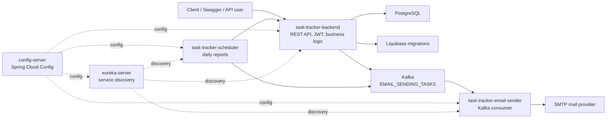
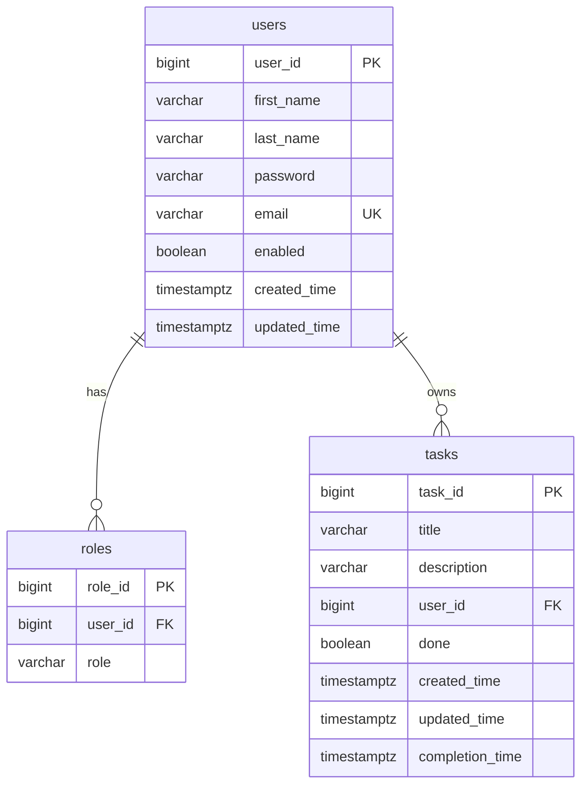

# Multiuser Task Scheduler 🚀

Микросервисное backend-приложение для управления задачами в многопользовательской среде.

Проект демонстрирует не только CRUD API, но и полноценную распределенную архитектуру: JWT-аутентификацию, централизованную конфигурацию, service discovery, PostgreSQL с миграциями Liquibase, асинхронную обработку email-команд через Kafka и отдельный scheduler-сервис для ежедневных отчетов по задачам.

## 🌟 Основные функции

### 👤 Работа с пользователями

- ✅ Регистрация и авторизация пользователей.
- 🔐 JWT-based authentication: access token + refresh token в cookie.
- 🧩 Ролевая модель доступа: `USER` и `ADMIN`.
- 🙋 Получение данных текущего пользователя.
- 👥 Получение списка пользователей вместе с их задачами.

### ✅ Работа с задачами

- ➕ Создание задач.
- ✏️ Редактирование задач.
- ✔️ Пометка задачи как выполненной.
- 🗑️ Удаление задач.
- 📋 Получение одной задачи или списка задач текущего пользователя.

### 📧 Умные оповещения по почте

- ✉️ Приветственное письмо после регистрации.
- 🔔 Ежедневные email-отчеты по задачам через отдельный scheduler-сервис.
- 📌 В отчет попадают:
  - задачи, выполненные за день;
  - задачи, которые еще предстоит выполнить.
- ⚡ Асинхронная доставка email-команд через Kafka topic `EMAIL_SENDING_TASKS`.

### 🧱 Инфраструктура и надежность

- 🗄️ PostgreSQL с версионированными миграциями Liquibase.
- 🧭 Service discovery через Eureka Server.
- ⚙️ Централизованная конфигурация через Spring Cloud Config.
- 🐳 Готовый Docker Compose для локального запуска всех сервисов.
- 📖 Swagger/OpenAPI-документация для backend API.

## 🏗️ Архитектура



## 🗃️ Схема базы данных

Backend-сервис использует PostgreSQL. Структура таблиц управляется Liquibase-миграциями.



🔎 Ключевые ограничения:

- `users.email` уникален.
- `roles.user_id` ссылается на `users.user_id` с `ON DELETE CASCADE`.
- `tasks.user_id` ссылается на `users.user_id` с `ON DELETE CASCADE`.
- `roles.role` ограничен значениями `USER` и `ADMIN`.
- Для связей созданы индексы `idx_roles_user_id` и `idx_tasks_user_id`.

## 🛠️ Технологический стек

| Категория | Технологии |
| --- | --- |
| Language / Runtime | Java 17 |
| Backend | Spring Boot 4, Spring Web, Spring Validation |
| Security | Spring Security, JWT |
| Data | Spring Data JPA, PostgreSQL, Liquibase |
| Microservices | Spring Cloud Config, Netflix Eureka |
| Messaging | Apache Kafka, Spring Kafka |
| Email | Spring Mail, SMTP |
| API docs | Springdoc OpenAPI, Swagger UI |
| Build / Runtime | Maven, Docker, Docker Compose |
| Testing | JUnit, Spring Boot Test, Spring Security Test, Testcontainers, Spring Kafka Test |

## 📦 Модули проекта

| Модуль | Назначение |
| --- | --- |
| `config-server` | Централизованная конфигурация микросервисов через Spring Cloud Config. |
| `eureka-server` | Service discovery для регистрации и обнаружения сервисов. |
| `task-tracker-backend` | Основной REST API: auth, users, tasks, JWT, PostgreSQL, Liquibase, Kafka publishing. |
| `task-tracker-scheduler` | Планировщик ежедневных отчетов по задачам; получает данные из backend и публикует email-команды в Kafka. |
| `task-tracker-email-sender` | Kafka consumer, который получает email-команды и отправляет письма через SMTP. |

## ⚡ Быстрый запуск

### 📋 Требования

- Docker и Docker Compose.
- Свободные порты: `5432`, `8888`, `8761`, `8080`, `8081`, `8082`, `9092`.

### 🐳 Запуск через Docker Compose

```powershell
copy .env.example .env
docker compose up --build
```

После запуска Docker Compose поднимет PostgreSQL, Kafka, Config Server, Eureka Server и все сервисы task tracker.

### 🔗 Основные адреса

| Сервис | URL |
| --- | --- |
| Backend API | `http://localhost:8080` |
| Swagger UI | `http://localhost:8080/swagger-ui.html` |
| Email Sender | `http://localhost:8081` |
| Scheduler | `http://localhost:8082` |
| Eureka Dashboard | `http://localhost:8761` |
| Config Server | `http://localhost:8888` |
| PostgreSQL | `localhost:5432` |
| Kafka | `localhost:9092` |

## 📡 API

📖 Подробная интерактивная документация доступна в Swagger UI:

```text
http://localhost:8080/swagger-ui.html
```

Основные группы endpoint'ов:

| Группа | Endpoint | Возможности |
| --- | --- | --- |
| Auth | `/api/v1/auth/signup` | Регистрация пользователя. |
| Auth | `/api/v1/auth/login` | Вход пользователя, выдача access token и refresh cookie. |
| Auth | `/api/v1/auth/logout` | Выход пользователя и очистка refresh cookie. |
| Auth | `/api/v1/auth/refresh-token` | Обновление access token по refresh token. |
| Tasks | `/api/v1/tasks` | Создание задачи, получение списка задач текущего пользователя. |
| Tasks | `/api/v1/tasks/{taskId}` | Получение, обновление и удаление задачи текущего пользователя. |
| Users | `/api/v1/users/current` | Получение данных текущего пользователя. |
| Users | `/api/v1/users` | Получение пользователей вместе с их задачами. |

🔐 Защищенные endpoint'ы используют Bearer JWT:

```http
Authorization: Bearer <access_token>
```

## 🧪 Тестирование

Запуск всех тестов из корня проекта:

```powershell
.\mvnw.cmd test
```

В проекте есть:

- controller tests для auth, users и tasks;
- integration tests для задач и Kafka-сценариев;
- Testcontainers для проверки backend-интеграций с реальной инфраструктурой;
- unit tests для формирования email-отчетов scheduler-сервисом;
- context load tests для микросервисов.

## 💼 Что проект демонстрирует работодателю

- Умение проектировать backend не как один монолитный CRUD, а как набор взаимодействующих сервисов.
- Практическое использование Spring Cloud Config и Eureka в микросервисной архитектуре.
- JWT-аутентификацию с access/refresh token flow.
- Event-driven взаимодействие через Kafka.
- Разделение ответственности между API, scheduler и email sender.
- Работу с PostgreSQL, JPA и версионированными миграциями Liquibase.
- Docker Compose окружение, которое можно быстро поднять локально.
- Наличие тестов на уровне controller, integration и messaging-сценариев.

## 📬 Контакты

- Автор: Биликтуев Батор
- Email: `batojjk@gmail.com`, `bator.biliktuev@mail.ru`
- GitHub: [BaTORfly](https://github.com/BaTORfly)
