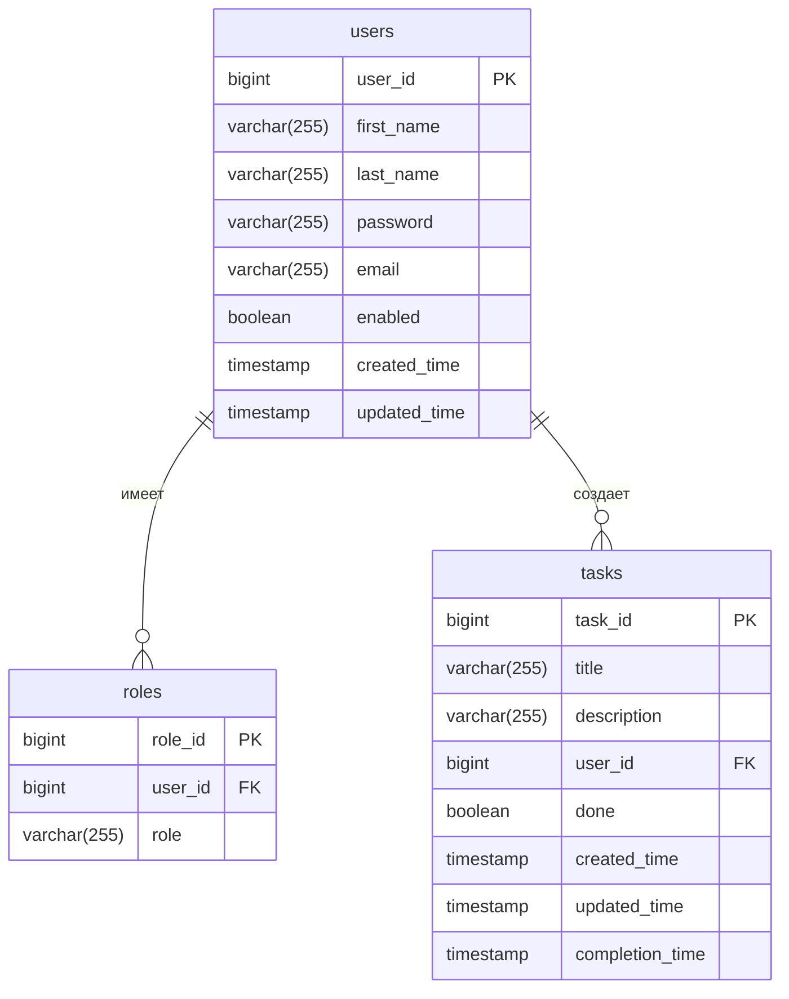

# Multiuser Task Scheduler 🚀

*Веб-приложение для управления задачами с многопользовательским доступом*

## 📌 Содержание
- [Схема базы данных] (#-схема-базы-данных)

## Схема базы данных

```mermaid
erDiagram
    users ||--o{ roles : "имеет"
    users ||--o{ tasks : "создает"
    
    users {
        bigint user_id PK
        varchar(255) first_name
        varchar(255) last_name
        varchar(255) password
        varchar(255) email
        boolean enabled
        timestamp created_time
        timestamp updated_time
    }
    
    roles {
        bigint role_id PK
        bigint user_id FK
        varchar(255) role
    }
    
    tasks {
        bigint task_id PK
        varchar(255) title
        varchar(255) description
        bigint user_id FK
        boolean done
        timestamp created_time
        timestamp updated_time
        timestamp completion_time
    }
```
