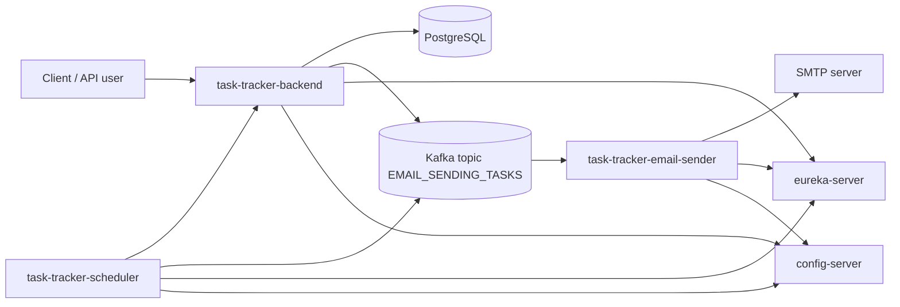

# Project Overview: Multiuser Task Scheduler

## Назначение

`Multiuser Task Scheduler` - микросервисная backend-система для управления пользовательскими задачами и email-уведомлениями. Проект показывает полный цикл: регистрация и авторизация пользователя, CRUD задач, хранение данных, асинхронная отправка писем и ежедневные отчеты по задачам.

Документ фиксирует систему на уровне, удобном для портфолио системного аналитика: границы, участники, основные процессы, сервисы и связи с детальными документами.

## Проблема и ценность

Пользователю нужен простой способ вести список задач и получать напоминания о состоянии дел. Система решает эту задачу через REST API и email-уведомления:

| Ценность | Как реализовано |
| --- | --- |
| Ведение задач | Пользователь создает, просматривает, изменяет, завершает и удаляет задачи. |
| Безопасный доступ | Используются JWT access token и refresh token в cookie. |
| Автоматические уведомления | После регистрации отправляется welcome email, scheduler формирует ежедневные отчеты. |
| Масштабируемая архитектура | Email-команды передаются через Kafka, сервисы разделены по ответственности. |

## Пользователи и роли

| Роль | Описание | Основные действия |
| --- | --- | --- |
| `USER` | Зарегистрированный пользователь системы. | Управляет своими задачами, получает email-уведомления. |
| `ADMIN` | Администратор системы. | Имеет доступ к списку пользователей с задачами. |
| Scheduler user | Системная учетная запись scheduler-сервиса. | Авторизуется в backend и получает пользователей с задачами для ежедневного отчета. |

## Состав системы

| Компонент | Назначение |
| --- | --- |
| `task-tracker-backend` | Основной REST API: auth, users, tasks, JWT, PostgreSQL, публикация email-команд в Kafka. |
| `task-tracker-scheduler` | Планировщик ежедневных отчетов: авторизуется в backend, получает пользователей и публикует email-команды. |
| `task-tracker-email-sender` | Kafka consumer, который отправляет письма через SMTP. |
| `config-server` | Централизованная конфигурация Spring Cloud Config. |
| `eureka-server` | Service discovery для регистрации и обнаружения сервисов. |
| PostgreSQL | Хранение пользователей, ролей и задач. |
| Kafka | Асинхронная передача email-команд. |

## Архитектурный контекст

Существующие C4-диаграммы:

- [System Context](architecture/c4_system_context.png)
- [Container Diagram](architecture/c4_container.png)

## Основные возможности

| Группа | Возможности | Детализация |
| --- | --- | --- |
| Авторизация | Signup, login, logout, refresh token. | [API](05_api_specification.md), [Use cases](04_use_cases.md) |
| Задачи | Создание, получение, обновление, удаление задач пользователя. | [Functional requirements](02_functional_requirements.md) |
| Пользователи | Получение текущего пользователя, получение пользователей с задачами для `ADMIN`. | [API](05_api_specification.md) |
| Email | Welcome email и ежедневные отчеты. | [Integration contracts](06_integration_contracts.md) |
| Данные | Пользователи, роли, задачи. | [Data model](07_data_model.md) |

## Что проект демонстрирует для роли системного аналитика

- Умение описывать границы системы и роли пользователей.
- Умение декомпозировать функциональность на требования и use cases.
- Умение фиксировать REST API и асинхронные интеграционные контракты.
- Умение описывать модель данных и связи сущностей.
- Умение связывать требования, сценарии и тестовые проверки.

