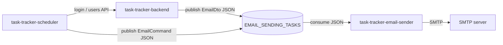

# Integration Contracts

## Общая схема интеграций



## IC-01. Backend -> Kafka -> Email-sender: welcome email

| Поле | Описание |
| --- | --- |
| Инициатор | `task-tracker-backend` |
| Producer | `KafkaService` |
| Consumer | `task-tracker-email-sender` / `KafkaEmailConsumer` |
| Topic | `EMAIL_SENDING_TASKS` |
| Trigger | Успешная регистрация пользователя. |
| Назначение | Отправить приветственное письмо новому пользователю. |

Payload:

```json
{
  "to": "john.smith@example.com",
  "header": "Welcome to our team, John!",
  "text": "Hi, John!\r\nYou've created account with email 'john.smith@example.com'. We hope you'll love our product!"
}
```

Правила:

| ID | Правило |
| --- | --- |
| IC-01-R1 | `to` содержит email зарегистрированного пользователя. |
| IC-01-R2 | `header` содержит имя пользователя. |
| IC-01-R3 | Сообщение сериализуется в JSON перед публикацией. |
| IC-01-R4 | При ошибке сериализации backend возвращает `UnexpectedServerException`. |

## IC-02. Scheduler -> Backend: авторизация

| Поле | Описание |
| --- | --- |
| Инициатор | `task-tracker-scheduler` |
| Provider | `task-tracker-backend` |
| Endpoint | `POST /api/v1/auth/login` |
| Auth | Нет на входе; используются scheduler credentials. |
| Назначение | Получить access token для запроса пользователей. |

Request:

```json
{
  "email": "scheduler@example.com",
  "password": "StrongPass123"
}
```

Response:

```json
{
  "access_token": "<jwt>"
}
```

Ошибки:

| Условие | Поведение scheduler |
| --- | --- |
| Backend вернул 4xx | `SchedulerAuthenticationException`. |
| Backend недоступен или RestClient error | `BackendClientException`. |
| Access token пустой | `SchedulerAuthenticationException`. |

## IC-03. Scheduler -> Backend: получение пользователей с задачами

| Поле | Описание |
| --- | --- |
| Инициатор | `task-tracker-scheduler` |
| Provider | `task-tracker-backend` |
| Endpoint | `GET /api/v1/users` |
| Auth | Bearer token системного пользователя с ролью `ADMIN`. |
| Назначение | Получить пользователей и задачи для ежедневного отчета. |

Response shape:

```json
[
  {
    "id": 1,
    "first_name": "John",
    "last_name": "Smith",
    "email": "john.smith@example.com",
    "tasks": [
      {
        "id": 10,
        "title": "Prepare report",
        "description": "Finish daily task report",
        "done": true,
        "completion_time": "2026-07-07T15:00:00Z"
      }
    ]
  }
]
```

Ошибки:

| Условие | Поведение scheduler |
| --- | --- |
| Backend вернул ошибочный статус | `BackendClientException`. |
| Response body пустой | Используется пустой список пользователей. |

## IC-04. Scheduler -> Kafka -> Email-sender: ежедневный отчет

| Поле | Описание |
| --- | --- |
| Инициатор | `task-tracker-scheduler` |
| Producer | `EmailCommandPublisher` |
| Consumer | `KafkaEmailConsumer` |
| Topic | `EMAIL_SENDING_TASKS` по умолчанию |
| Key | Email получателя (`command.to()`) |
| Назначение | Передать email-команды ежедневных отчетов. |

Payload:

```json
{
  "to": "john.smith@example.com",
  "header": "Daily task report",
  "text": "Completed yesterday: ...\nUnfinished tasks: ..."
}
```

Правила:

| ID | Правило |
| --- | --- |
| IC-04-R1 | Период отчета - предыдущий день в timezone `scheduler.reports.zone`. |
| IC-04-R2 | В отчет попадают completed tasks с `done = true` и `completion_time` внутри периода. |
| IC-04-R3 | В отчет попадают unfinished tasks с `done = false`. |
| IC-04-R4 | Пользователи без задач пропускаются. |
| IC-04-R5 | Публикация scheduler ожидает подтверждение Kafka через `.get()`. |

Ошибки:

| Условие | Поведение |
| --- | --- |
| Ошибка JSON serialization | `EmailPublishingException: Could not serialize email command`. |
| InterruptedException | Thread interrupt восстанавливается, затем `EmailPublishingException`. |
| ExecutionException при Kafka publish | `EmailPublishingException: Could not publish email command to Kafka`. |
| Невалидный JSON в consumer | Runtime exception при десериализации. |
| Ошибка SMTP | Ошибка логируется, consumer продолжает работать по настройкам Kafka listener. |

