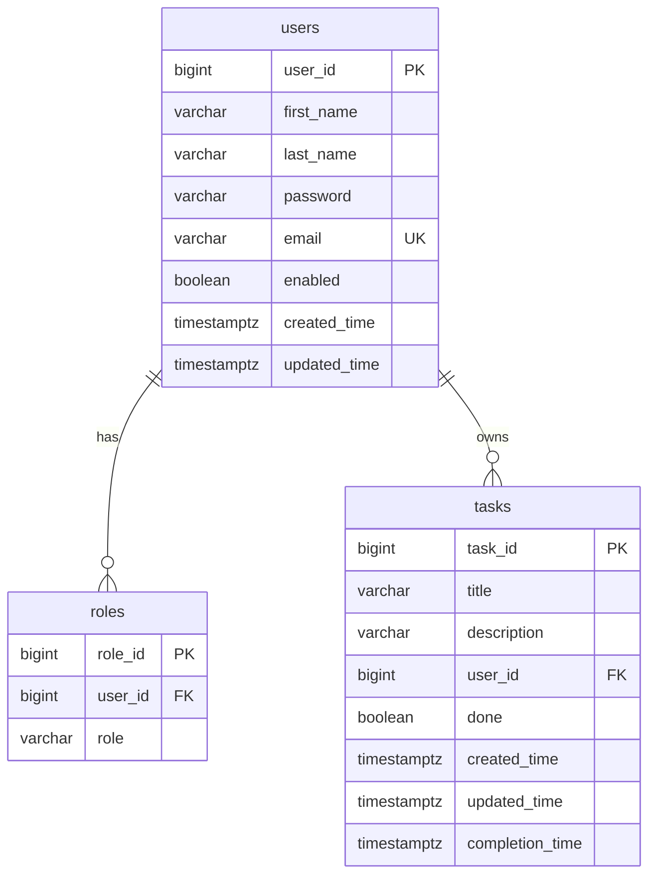
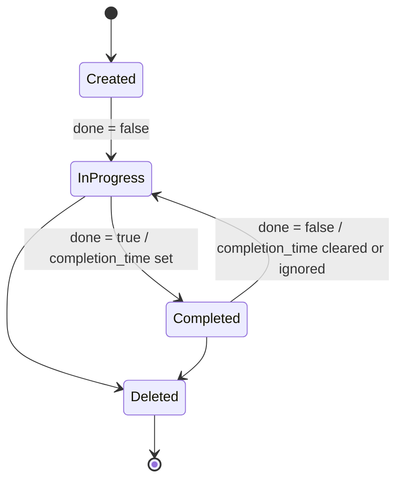

# Data Model

## ER Diagram

## Сущность `users`

| Поле | Тип | Ограничения | Назначение |
| --- | --- | --- | --- |
| `user_id` | `BIGINT` | PK, identity | Уникальный идентификатор пользователя. |
| `first_name` | `VARCHAR(255)` | `NOT NULL` | Имя пользователя. |
| `last_name` | `VARCHAR(255)` | `NOT NULL` | Фамилия пользователя. |
| `password` | `VARCHAR(255)` | `NOT NULL` | BCrypt hash пароля. |
| `email` | `VARCHAR(255)` | `NOT NULL`, `UNIQUE` | Email и логин пользователя. |
| `enabled` | `BOOLEAN` | `NOT NULL`, default `FALSE` | Признак активности учетной записи. |
| `created_time` | `TIMESTAMPTZ` | `NOT NULL`, default `NOW()` | Дата создания. |
| `updated_time` | `TIMESTAMPTZ` | `NOT NULL`, default `NOW()` | Дата обновления. |

## Сущность `roles`

| Поле | Тип | Ограничения | Назначение |
| --- | --- | --- | --- |
| `role_id` | `BIGINT` | PK, identity | Уникальный идентификатор роли. |
| `user_id` | `BIGINT` | `NOT NULL`, FK | Пользователь, которому назначена роль. |
| `role` | `VARCHAR(32)` | `NOT NULL` | Значение роли: `USER` или `ADMIN`. |

Связь: один пользователь может иметь несколько записей ролей.

## Сущность `tasks`

| Поле | Тип | Ограничения | Назначение |
| --- | --- | --- | --- |
| `task_id` | `BIGINT` | PK, identity | Уникальный идентификатор задачи. |
| `title` | `VARCHAR(255)` | `NOT NULL` | Название задачи. |
| `description` | `VARCHAR(255)` | nullable | Описание задачи. |
| `user_id` | `BIGINT` | `NOT NULL`, FK | Владелец задачи. |
| `done` | `BOOLEAN` | `NOT NULL`, default `FALSE` | Признак выполнения. |
| `created_time` | `TIMESTAMPTZ` | `NOT NULL`, default `NOW()` | Дата создания задачи. |
| `updated_time` | `TIMESTAMPTZ` | `NOT NULL`, default `NOW()` | Дата последнего обновления. |
| `completion_time` | `TIMESTAMPTZ` | nullable | Дата завершения задачи. |

## Жизненный цикл задачи

## Бизнес-связи

| Связь | Описание |
| --- | --- |
| `users` -> `roles` | Пользователь получает роли для авторизации в Spring Security. |
| `users` -> `tasks` | Каждая задача принадлежит одному пользователю. |
| `tasks.done` + `tasks.completion_time` | Используются scheduler-сервисом для отбора задач в ежедневный отчет. |

## Миграции

Схема управляется Liquibase:

| Файл | Назначение |
| --- | --- |
| `001-create-tables.sql` | Создание таблиц `users`, `roles`, `tasks`. |
| `002-add-constraints.sql` | Добавление ограничений и внешних ключей. |
| `003-add-indexes.sql` | Индексы для ускорения запросов. |
| `004-insert-admin.sql` | Начальная admin/scheduler запись. |
| `005-insert-users.sql` | Демонстрационные пользователи. |
| `006-insert-user-tasks.sql` | Демонстрационные задачи. |

