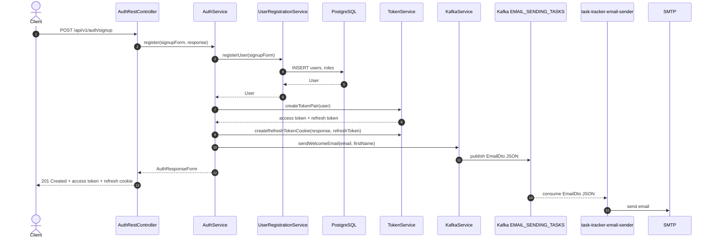
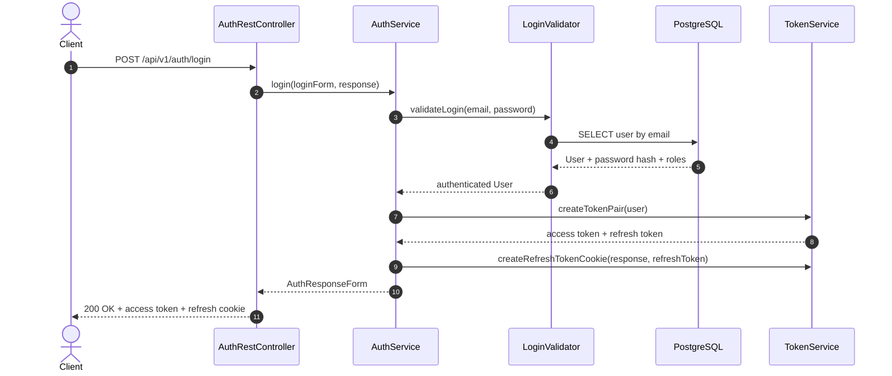
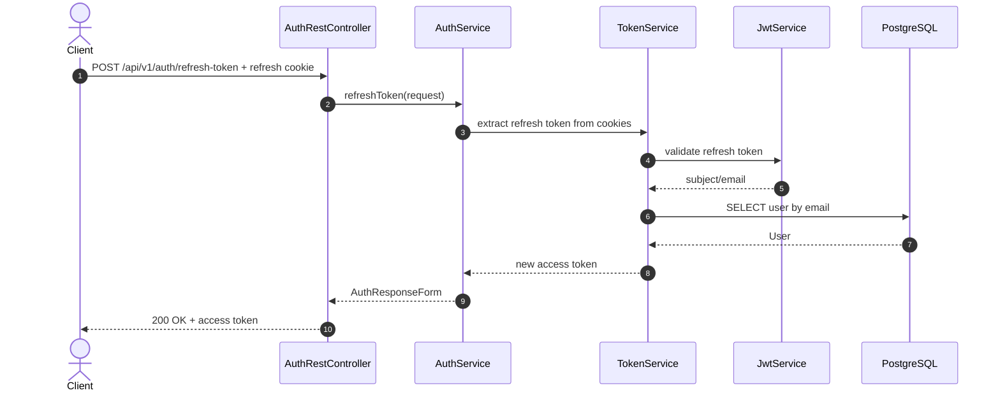
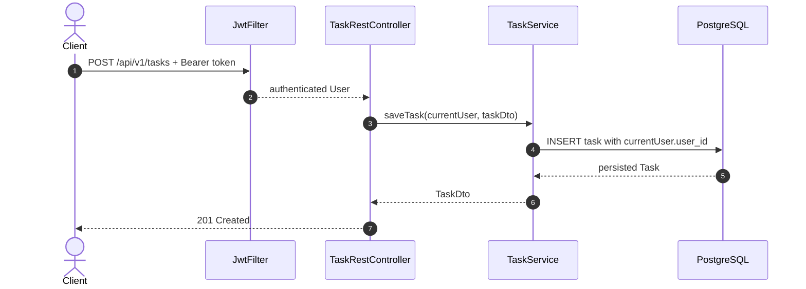
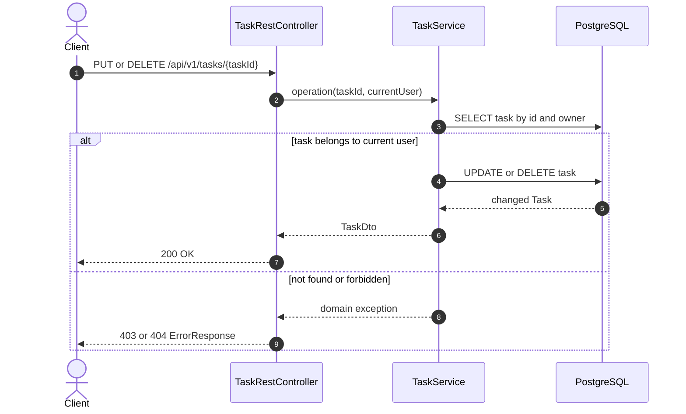
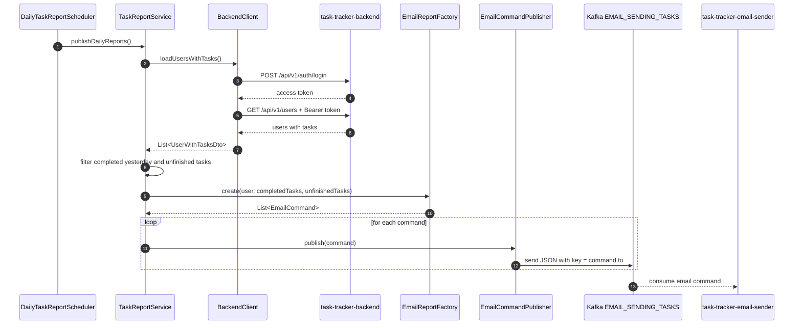

# Sequence Diagrams

## Signup и welcome email

```mermaid
sequenceDiagram
    autonumber
    actor Client
    participant AuthController as AuthRestController
    participant AuthService
    participant Registration as UserRegistrationService
    participant DB as PostgreSQL
    participant TokenService
    participant KafkaService
    participant Kafka as Kafka EMAIL_SENDING_TASKS
    participant EmailSender as task-tracker-email-sender
    participant SMTP

    Client->>AuthController: POST /api/v1/auth/signup
    AuthController->>AuthService: register(signupForm, response)
    AuthService->>Registration: registerUser(signupForm)
    Registration->>DB: INSERT users, roles
    DB-->>Registration: User
    Registration-->>AuthService: User
    AuthService->>TokenService: createTokenPair(user)
    TokenService-->>AuthService: access token + refresh token
    AuthService->>TokenService: createRefreshTokenCookie(response, refreshToken)
    AuthService->>KafkaService: sendWelcomeEmail(email, firstName)
    KafkaService->>Kafka: publish EmailDto JSON
    AuthService-->>AuthController: AuthResponseForm
    AuthController-->>Client: 201 Created + access token + refresh cookie
    Kafka-->>EmailSender: consume EmailDto JSON
    EmailSender->>SMTP: send email
```

## Login

```mermaid
sequenceDiagram
    autonumber
    actor Client
    participant AuthController as AuthRestController
    participant AuthService
    participant LoginValidator
    participant DB as PostgreSQL
    participant TokenService

    Client->>AuthController: POST /api/v1/auth/login
    AuthController->>AuthService: login(loginForm, response)
    AuthService->>LoginValidator: validateLogin(email, password)
    LoginValidator->>DB: SELECT user by email
    DB-->>LoginValidator: User + password hash + roles
    LoginValidator-->>AuthService: authenticated User
    AuthService->>TokenService: createTokenPair(user)
    TokenService-->>AuthService: access token + refresh token
    AuthService->>TokenService: createRefreshTokenCookie(response, refreshToken)
    AuthService-->>AuthController: AuthResponseForm
    AuthController-->>Client: 200 OK + access token + refresh cookie
```

## Refresh token

```mermaid
sequenceDiagram
    autonumber
    actor Client
    participant AuthController as AuthRestController
    participant AuthService
    participant TokenService
    participant JwtService
    participant DB as PostgreSQL

    Client->>AuthController: POST /api/v1/auth/refresh-token + refresh cookie
    AuthController->>AuthService: refreshToken(request)
    AuthService->>TokenService: extract refresh token from cookies
    TokenService->>JwtService: validate refresh token
    JwtService-->>TokenService: subject/email
    TokenService->>DB: SELECT user by email
    DB-->>TokenService: User
    TokenService-->>AuthService: new access token
    AuthService-->>AuthController: AuthResponseForm
    AuthController-->>Client: 200 OK + access token
```

## Создание задачи

```mermaid
sequenceDiagram
    autonumber
    actor Client
    participant JwtFilter
    participant TaskController as TaskRestController
    participant TaskService
    participant DB as PostgreSQL

    Client->>JwtFilter: POST /api/v1/tasks + Bearer token
    JwtFilter-->>TaskController: authenticated User
    TaskController->>TaskService: saveTask(currentUser, taskDto)
    TaskService->>DB: INSERT task with currentUser.user_id
    DB-->>TaskService: persisted Task
    TaskService-->>TaskController: TaskDto
    TaskController-->>Client: 201 Created
```

## Обновление и удаление задачи

```mermaid
sequenceDiagram
    autonumber
    actor Client
    participant TaskController as TaskRestController
    participant TaskService
    participant DB as PostgreSQL

    Client->>TaskController: PUT or DELETE /api/v1/tasks/{taskId}
    TaskController->>TaskService: operation(taskId, currentUser)
    TaskService->>DB: SELECT task by id and owner
    alt task belongs to current user
        TaskService->>DB: UPDATE or DELETE task
        DB-->>TaskService: changed Task
        TaskService-->>TaskController: TaskDto
        TaskController-->>Client: 200 OK
    else not found or forbidden
        TaskService-->>TaskController: domain exception
        TaskController-->>Client: 403 or 404 ErrorResponse
    end
```

## Ежедневный отчет scheduler

```mermaid
sequenceDiagram
    autonumber
    participant Cron as DailyTaskReportScheduler
    participant ReportService as TaskReportService
    participant BackendClient
    participant Backend as task-tracker-backend
    participant Factory as EmailReportFactory
    participant Publisher as EmailCommandPublisher
    participant Kafka as Kafka EMAIL_SENDING_TASKS
    participant EmailSender as task-tracker-email-sender

    Cron->>ReportService: publishDailyReports()
    ReportService->>BackendClient: loadUsersWithTasks()
    BackendClient->>Backend: POST /api/v1/auth/login
    Backend-->>BackendClient: access token
    BackendClient->>Backend: GET /api/v1/users + Bearer token
    Backend-->>BackendClient: users with tasks
    BackendClient-->>ReportService: List<UserWithTasksDto>
    ReportService->>ReportService: filter completed yesterday and unfinished tasks
    ReportService->>Factory: create(user, completedTasks, unfinishedTasks)
    Factory-->>ReportService: List<EmailCommand>
    loop for each command
        ReportService->>Publisher: publish(command)
        Publisher->>Kafka: send JSON with key = command.to
    end
    Kafka-->>EmailSender: consume email command
```

